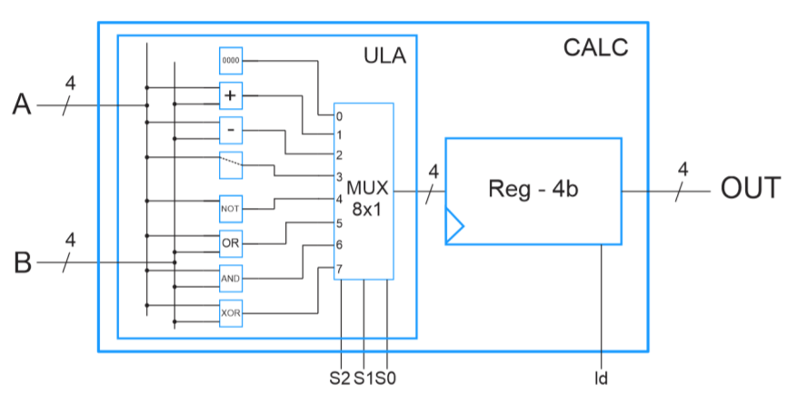
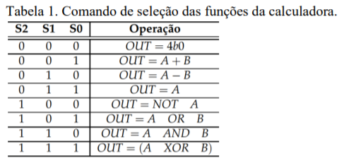
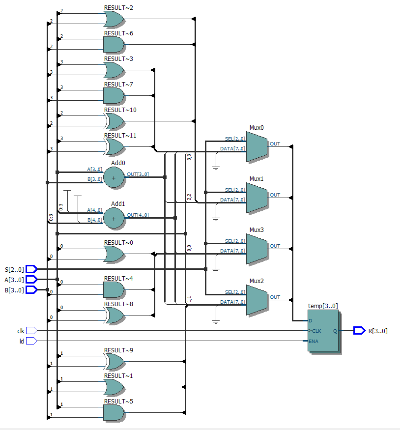
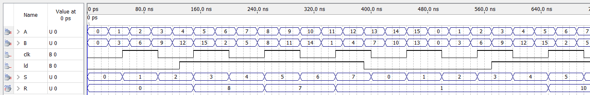

  

  
  
  

  

  

  <a href="#desafio">Desafio</a>&nbsp;&nbsp;&nbsp;|&nbsp;&nbsp;&nbsp;
  <a href="#-projeto">Projeto RTL</a>&nbsp;&nbsp;&nbsp;|&nbsp;&nbsp;&nbsp;
  <a href="#-projeto">Resultado da simulação</a>&nbsp;&nbsp;&nbsp;|&nbsp;&nbsp;&nbsp;
  <a href="#-como-contribuir">Como contribuir</a>&nbsp;&nbsp;&nbsp;|&nbsp;&nbsp;&nbsp;
  <a href="#memo-licença">Licença</a>

 

  

## :rocket: Desafio
Montar o circuito de uma calculadora aritmética e lógica de 4 bits com memória.
Esta é controlada por uma entrada de habilitação ld: caso ld = 1, habilita a carga no registrador; caso ld = 0,
mantém o último resultado da operação da ULA, logo, mesmo ocorrendo uma nova operação, o resultado
permanece inalterado. Apresenta três entradas de seleção (S0, S1 e S2) para escolha da função a ser efetuada,
conforme Tabela 1.

  

## 💻 Projeto RTL

- S: representa o S2, S1 e S0 como entradas de seleção da função desejada.
- A e B: representa as entradas.
- clk: representa o clock.
- ld: representa a habilitação da carga do registrador.
- R: representa a saída do resultado.

  

## 💻 Resultado da simulação

Foi configurado as ondas para realizar a simulação através da função "Simulation wave form" do Quartus II.

  

## 🤔 Como contribuir

- Faça um fork desse repositório;
- Cria uma branch com a sua feature: `git checkout -b minha-feature`;
- Faça commit das suas alterações: `git commit -m 'feat: Minha nova feature'`;
- Faça push para a sua branch: `git push origin minha-feature`.

Depois que o merge da sua pull request for feito, você pode deletar a sua branch.

## :memo: Licença

Esse projeto está sob a licença MIT. Veja o arquivo [LICENSE](LICENSE.md) para mais detalhes.

---

Feito com ♥ by John Victor ☕ Code and coffee